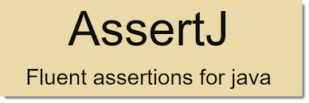

# AssertJ
### Acelera la escritura de test y mejora la legibilidad con una librería de pruebas con API fluida.

[Documentación](https://assertj.github.io/doc/)

Ejemplos:

* [Básico](src/test/java/org/anyulled/model/PatientShould.java).
* [Comparación recursiva](src/test/java/org/anyulled/model/RecursivePatientShould.java).
* [Afirmaciones suaves](src/test/java/org/anyulled/model/SoftAssertionPatientShould.java)
* [Listas](src/test/java/org/anyulled/model/PatientListShould.java) .
* [Manejo de Excepciones](src/test/java/service/PatientServiceShould.java).
* [Estilo BDD](src/test/java/org/anyulled/model/BDDPatientShould.java).
* [Clases personalizadas](src/test/java/org/anyulled/model/CustomAssertionPatientShould.java).
